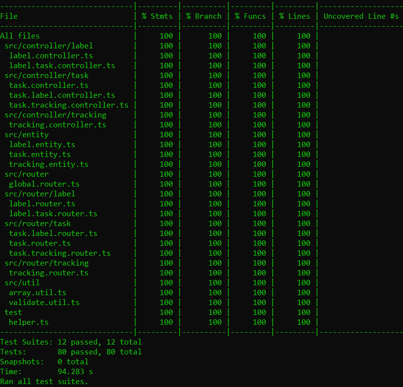
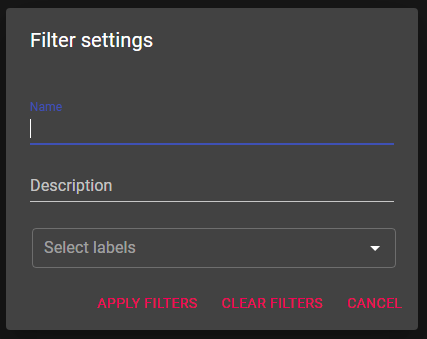
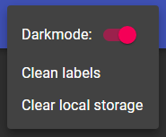
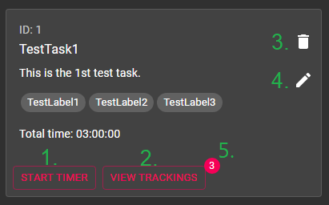

[](https://www.h-da.de/ "Hochschule Darmstadt")

🏛 [Fachbereich Informatik](https://fbi.h-da.de/ "Fachbereich Informatik") - [Hochschule Darmstadt](https://www.h-da.de/ "Hochschule Darmstadt")
<br>

> :warning: **Note:** This project was developed in the course of a homework for the subject FWE ("Fortgeschrittene Webentwicklung"). This is just a export of the final version. The development took place on the GitLab servers of the Hochschule Darmstadt.

# 🚩 Task-Time Tracking App

    

## Table of content

- [📋 About the project](#-about-the-project)
  - [👥 Development](#-development)
- [🛠 Setup the project](#-setup-the-project)
- [🔍 Test the project](#-test-the-project)
  - [Testing automatically](#1-testing-automatically)
  - [Testing manually](#2-testing-manually)
- [💡 Frontend Reference](#-frontend-reference)
- [🖥️ API Reference](#%EF%B8%8F-api-reference)
  - [Route `/label`](#route-label)
    - [Route `/label/:label/task`](#route-labellabeltask)
  - [Route `/task`](#route-task)
    - [Route `/task/:taskId/label`](#route-tasktaskidlabel)
    - [Route `/task/:taskId/tracking`](#route-tasktaskidtracking)
  - [Route `/tracking`](#route-tracking)
- [⚠ Status codes](#-status-codes)
- [© License](#-license)

# 📋 About the project

**A pretty common problem:** Every single day we have so many things to do at work that it sometimes becomes a little confusing as to what we actually spend and how much time.

> Time equals money, but also quality of life.

**Our solution:** Don't worry, we got something for you! So that we can solve this problem, we're creating a time tracker application that gives us a better overview of everyday tasks. **This second part now finally includes the cool modern looking frontend!**

In this stage of the devolvement, using the project, you're able to create tasks and add labels as well as time trackings to them. You can also get all tasks with an certain label. Or all existing tracking/labels. It's even possible to create a sample task activity, if you're unsure what to do today or you're just bored from programming all day long.

Whatever brought you here, we wish you an awesome time playing around with our little project here and feel free to contact us whenever you got a question and/or encountering some difficulties or problems. You can also simple report errors on our "Issues" section of the GitLab project.

## 👥 Development

The participants or contributors of this project include:

🎓 **Walther, Ramon**<br>
GitLab: [@istrawalt](https://code.fbi.h-da.de/istrawalt "@istrawalt")<br>
Mail: Ramon@BetaLabs.io

_This project is kindly supervised by T. Sauer / D. Schulz / D. Wohlfarth._

# 🛠 Setup the project

There is barley nothing easier than setting up this project. Just follow this 3 steps and you're ready to go:

1. Move over to the `fwe-app/fwe-api/` folder and create a `.env` file based on the `.env.example`. For default values use the `.env.dist` as base. After that repeat this process for the `fwe-app/fwe-frontend/` folder.
2. Now head back to the root folder and execute the following command:

   ```
   make start
   ```

   Alternatively if you can't use `make`, run:

   ```
   docker-compose up
   ```

   **Note:** In some cases, the creation of the DB docker is slower than the API docker. This is resulting in the API docker failing to connect to the DB and automatically synchronies the db schema. If this is the case, make sure to restart the project or execute the following command manually as soon as the db is up and running:

   ```
   make dbsync
   ```

   Alternatively if you can't use `make`, run:

   ```
   docker-compose exec fwe-api npm run typeorm schema:sync
   ```

3. Thats it, your done, it's as simple as that! Your servers should be running now and got a working connection to the DB. You can verify this by checking the console output, which should tell you something like this:

   ```
   You can now view fwe-frontend in the browser.

      Local:            http://localhost:80
      On Your Network:  http://172.18.0.3:80
   ```

   **Note:** The build process of the frontend could take a few minutes, so please be patient.

Oh and by the way, if you're willing to stop the running server ever again, try executing the following command at the root dir:

```
make stop
```

Alternatively if you can't use `make`, run:

```
docker-compose down
```

# 🔍 Test the project

So we included two separate options for you to test the project:

## 1. Testing automatically

This project includes defined automated tests (using jest and cypress). This helps you testing the project easily without spending hours and hours to check every existing route and functionality manually. The already defined api tests are used to test **every single route** for a minimum of a good and bad path. The frontend tests include component as well as E2E tests.

To run all tests, you have to simply start the servers and execute the following command at the root dir:

```
make test
```

Alternatively if you can't use `make`, run:

```
docker-compose exec fwe-api npm run test
docker-compose exec fwe-frontend npm run test
```

Depending on the system you're running the tests on, this takes up to a couple of minutes. After that, you're ending up with a detailed overview of the code coverage (_which should be at 100%!_) and the result of the executed tests (_which should tell you that all 80 tests were passed successfully_) for the backend. Followed by the test results of the frontend jest tests.



To start the cypress test environment execute the following command at the root dir:

```
make cypress
```

Alternatively if you can't use `make`, move over to the `fwe-app/cypress/` folder and run:

```
npm i
npm run cypress
```

### Specify what part to test:

If you just want to run the **frontend** tests, execute the following command at the root dir:

```
make ftest
```

Alternatively if you can't use `make`, run:

```
docker-compose exec fwe-frontend npm run test
```

And if you just wanna run the **backend** tests, execute the following command at the root dir:

```
make btest
```

Alternatively if you can't use `make`, run:

```
docker-compose exec fwe-api npm run test
```

## 2. Testing manually

If you willing to test the project, especially the backend, manually or wanna test a specific - not in the predefined test included - case, we recommend using the free and easy to use software [Postman](https://www.postman.com/). We also included all routes with a simple examples in our [Postman Collection](fwe-app/fwe-api/doc/postman/FWE-Backend.postman_collection.json) we're providing with this project. So feel free to test as much as you want, but keep in mind at some point you're going to run out of coffee!

Note that the predefined postman collection is based on the fixtures also delivered with the project. To add this example fixtures to your database simple execute the following command at the root dir:

```
make fixtures
```

Alternatively if you can't use `make`, run:

```
docker-compose exec fwe-api npm run fixtures
```

# 💡 Frontend Reference

This is a short introduction to the essential functions as well as to some special features. But for most parts, the frontend is very user friendly and self-explanatory. So we keep this Reference kinda short by purpose. Well, then lets start already!

To open the "Create a new task" Modal, simply click the "+" Button in the lower right corner:


To apply a filter, the Filter Icon (left one) at the top right of the page:


This will open the following "Apply a filter" dialog:



Here you can filter for the name, the description, or multiple labels.

**Note:** All applied filters add up to a single filter! So for example if you set two labels, only the tasks that include both will be visible.


To other Settings icon (right one) at the top right of the page, will open a simple menu:



Here you got the opportunity to switch between a dark and a light theme.

You can also run the "Clean labels" procedure. This will automatically remove all unused labels, that doesn't belong to a single task right now, from the database.

**Note:** This routine is executed automatically every time the user refreshes the page. Watch the bottom left corner for a message telling you, that labels were removed :)

So and last but not least you also got the opportunity to use the built in "Clear local storage" functionality. This is going to clear all data of this page from your local storage. This Site uses the local storage to save couple of information's to save to state of the page, if the user for example refreshes or expediently closes the browser tab.

Next we got a example task view and some explanations to the marked (green numbers) parts:



1. This button will start a timer. You can stop or pause the timer as you wish. To stop the timer you have to provide a description of what you did. You can also cancel the timer at any time.

2. Here you can open up a overview of all tracking belonging to the task. You can also add trackings manually or edit the already tracked ones. Or if you wish to, you can delete trackings as well.

3. Click this little button, to delete the task and its trackings etc.

4. Switch into the edit mode of this task. You can change for example the name or description. You can also add or remove labels. You can even create new labels, just add them to the task and the app will create them when you save your edit. You can then pick your new labels on every other part of the page as well!

5. This indication shows how many trackings this task has. If the task got none, the indicator is hidden.

Okay, so that should be enough for now. As we said, the rest is super easy to understand and shouldn't pose any major difficulties. But If it does, feel free to contact us!

# 🖥️ API Reference

This is a simple overview of all routes provided by the API, grouped by their routers and sorted alphabetically. The reference also includes a special "bonus" method `Get example task` which wasn't planned at the beginning of the project. Check out its [details page](fwe-app/fwe-api/doc/api_reference/task/task/getExampleTask.md) to find out more about how to use it and whats up with this special feature!

**Note:** For further information's including examples on each route, just click their method descriptions.

## Route `/label`

| Method                                                                             | URL                          |
| ---------------------------------------------------------------------------------- | ---------------------------- |
| [Create label](fwe-app/fwe-api/doc/api_reference/label/label/createLabel.md)       | `POST /api/label/`           |
| [Delete label by id](fwe-app/fwe-api/doc/api_reference/label/label/deleteLabel.md) | `DELETE /api/label/:labelId` |
| [Get label by id](fwe-app/fwe-api/doc/api_reference/label/label/getLabel.md)       | `GET /api/label/:labelId`    |
| [Get labels](fwe-app/fwe-api/doc/api_reference/label/label/getLabels.md)           | `GET /api/label/`            |
| [Patch label by id](fwe-app/fwe-api/doc/api_reference/label/label/patchLabel.md)   | `PATCH /api/label/:labelId`  |

### Route `/label/:label/task`

| Method                                                                                      | URL                             |
| ------------------------------------------------------------------------------------------- | ------------------------------- |
| [Get tasks with label](fwe-app/fwe-api/doc/api_reference/label/label.task/getLabelTasks.md) | `GET /api/label/:labelId/task/` |

## Route `/task`

| Method                                                                                        | URL                        |
| --------------------------------------------------------------------------------------------- | -------------------------- |
| [Create task](fwe-app/fwe-api/doc/api_reference/task/task/createTask.md)                      | `POST /api/task/`          |
| [Delete task by id](fwe-app/fwe-api/doc/api_reference/task/task/deleteTask.md)                | `DELETE /api/task/:taskId` |
| [Get example task](fwe-app/fwe-api/doc/api_reference/task/task/getExampleTask.md) **[BONUS]** | `POST /api/task/example`   |
| [Get task by id](fwe-app/fwe-api/doc/api_reference/task/task/getTask.md)                      | `GET /api/task/:taskId`    |
| [Get tasks](fwe-app/fwe-api/doc/api_reference/task/task/getTasks.md)                          | `GET /api/task/`           |
| [Patch task by id](fwe-app/fwe-api/doc/api_reference/task/task/patchTask.md)                  | `PATCH /api/task/:taskId`  |

### Route `/task/:taskId/label`

| Method                                                                                           | URL                                       |
| ------------------------------------------------------------------------------------------------ | ----------------------------------------- |
| [Add label to task](fwe-app/fwe-api/doc/api_reference/task/task.label/addTaskLabel.md)           | `POST /api/task/:taskId/label/:labelId`   |
| [Add labels to task](fwe-app/fwe-api/doc/api_reference/task/task.label/addTaskLabels.md)         | `POST /api/task/:taskId/label/`           |
| [Get labels of task](fwe-app/fwe-api/doc/api_reference/task/task.label/getTaskLabels.md)         | `GET /api/task/:taskId/label/`            |
| [Remove label from task](fwe-app/fwe-api/doc/api_reference/task/task.label/removeTaskLabel.md)   | `DELETE /api/task/:taskId/label/:labelId` |
| [Remove labels from task](fwe-app/fwe-api/doc/api_reference/task/task.label/removeTaskLabels.md) | `DELETE /api/task/:taskId/label/`         |
| [Update labels of task](fwe-app/fwe-api/doc/api_reference/task/task.label/updateTaskLabels.md)   | `PATCH /api/task/:taskId/label/`          |

### Route `/task/:taskId/tracking`

| Method                                                                                                    | URL                                             |
| --------------------------------------------------------------------------------------------------------- | ----------------------------------------------- |
| [Add tracking to task](fwe-app/fwe-api/doc/api_reference/task/task.tracking/addTaskTracking.md)           | `POST /api/task/:taskId/tracking/:trackingId`   |
| [Add trackings to task](fwe-app/fwe-api/doc/api_reference/task/task.tracking/addTaskTrackings.md)         | `POST /api/task/:taskId/tracking/`              |
| [Get trackings of task](fwe-app/fwe-api/doc/api_reference/task/task.tracking/getTaskTrackings.md)         | `GET /api/task/:taskId/tracking/`               |
| [Remove tracking from task](fwe-app/fwe-api/doc/api_reference/task/task.tracking/removeTaskTracking.md)   | `DELETE /api/task/:taskId/tracking/:trackingId` |
| [Remove trackings from task](fwe-app/fwe-api/doc/api_reference/task/task.tracking/removeTaskTrackings.md) | `DELETE /api/task/:taskId/tracking/`            |
| [Update trackings of task](fwe-app/fwe-api/doc/api_reference/task/task.tracking/updateTaskTrackings.md)   | `PATCH /api/task/:taskId/tracking/`             |

## Route `/tracking`

| Method                                                                                | URL                                |
| ------------------------------------------------------------------------------------- | ---------------------------------- |
| [Create tracking](fwe-app/fwe-api/doc/api_reference/tracking/createTracking.md)       | `POST /api/tracking/`              |
| [Delete tracking by id](fwe-app/fwe-api/doc/api_reference/tracking/deleteTracking.md) | `DELETE /api/tracking/:trackingId` |
| [Get tracking by id](fwe-app/fwe-api/doc/api_reference/tracking/getTracking.md)       | `GET /api/tracking/:trackingId`    |
| [Get trackings](fwe-app/fwe-api/doc/api_reference/tracking/getTrackings.md)           | `GET /api/tracking/`               |
| [Patch tracking by id](fwe-app/fwe-api/doc/api_reference/tracking/patchTracking.md)   | `PATCH /api/tracking/:trackingId`  |

# ⚠ Status codes

The following table gives you a simple overview of the used http status codes used by the project and its respective meaning:

| STATUS CODE                 | Description                                                                                                                                   |
| --------------------------- | --------------------------------------------------------------------------------------------------------------------------------------------- |
| `200 OK`                    | Indicates that the request has succeeded.                                                                                                     |
| `201 Created`               | Indicates that the request has succeeded and a new resource has been created as a result.                                                     |
| `204 No Content`            | The server has fulfilled the request but doesn't need to return a response body.                                                              |
|                             |
| `400 Bad Request`           | The request couldn't be understood by the server due to incorrect syntax. The client **SHOULD NOT** repeat the request without modifications. |
| `404 Not Found`             | The server cannot find the requested resource.                                                                                                |
|                             |
| `500 Internal Server Error` | The server encountered an unexpected condition which prevented it from fulfilling the request.                                                |

# © License

**[MIT license](https://opensource.org/licenses/MIT)**

Copyright 2020 - Ramon Walther <<Ramon@BetaLabs.io>>

> Permission is hereby granted, free of charge, to any person obtaining a copy of this software and associated documentation files (the "Software"), to deal in the Software without restriction, including without limitation the rights to use, copy, modify, merge, publish, distribute, sublicense, and/or sell copies of the Software, and to permit persons to whom the Software is furnished to do so, subject to the following conditions:
>
> The above copyright notice and this permission notice shall be included in all copies or substantial portions of the Software.
>
> THE SOFTWARE IS PROVIDED "AS IS", WITHOUT WARRANTY OF ANY KIND, EXPRESS OR IMPLIED, INCLUDING BUT NOT LIMITED TO THE WARRANTIES OF MERCHANTABILITY, FITNESS FOR A PARTICULAR PURPOSE AND NONINFRINGEMENT. IN NO EVENT SHALL THE AUTHORS OR COPYRIGHT HOLDERS BE LIABLE FOR ANY CLAIM, DAMAGES OR OTHER LIABILITY, WHETHER IN AN ACTION OF CONTRACT, TORT OR OTHERWISE, ARISING FROM, OUT OF OR IN CONNECTION WITH THE SOFTWARE OR THE USE OR OTHER DEALINGS IN THE SOFTWARE.

_This file was last edited by Ramon Walther on 2020-12-13._
